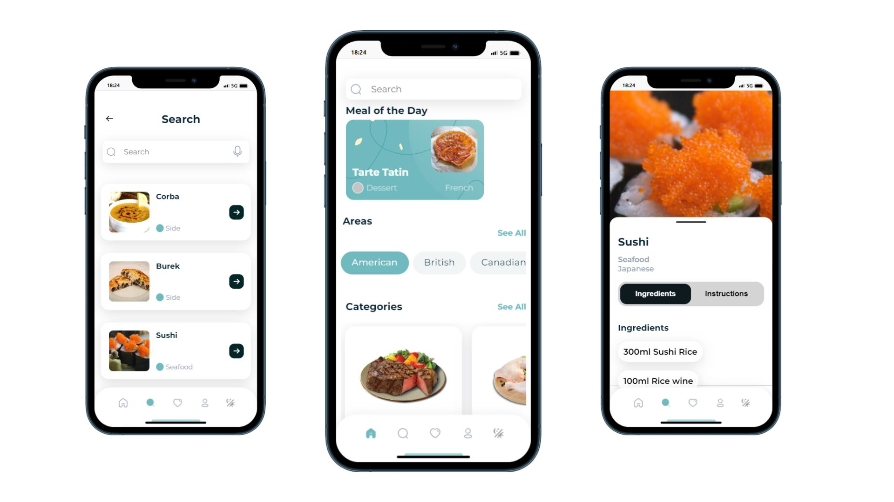

# Tasty App - Project Readme

## Table of Contents

- [Demo](#demo)
- [About the Tasty App](#about-the-tasty-app)
- [Features](#features)
- [Technologies Used](#technologies-used)
- [Installation](#installation)
- [Usage](#usage)
- [Contributing](#contributing)
- [Authors](#authors)
- [License](#license)

## Demo

A live demo of the Tasty App is available at: [https://delightful-cheesecake-9b19f0.netlify.app/](https://delightful-cheesecake-9b19f0.netlify.app/) (hosted on Netlify)

## About the Tasty App

The Tasty App is a collaborative project developed by five participants as part of a project course. The objective was to create a user-friendly web application that allows users to search for recipes based on various criteria. The app was developed using React, CSS, and a REST API, and it offers a range of features to facilitate the exploration and preparation of dishes. The Tasty App is responsive and can be used on desktop and mobile devices. It is available in English.

## Features

The Tasty App offers a wide array of features:

- **Recipe Search:** Users can search for recipes along with their ingredients and instructions.
- **Categorical Filters:** Recipes can be filtered by categories such as British, Indian, European, and more.
- **Geographic Filters:** Users can explore recipes based on geographical regions.
- **API Integration:** The app utilizes the [themealdb.com](https://www.themealdb.com) API to fetch recipe data.
- **Dark Mode:** Users can toggle a dark mode for improved readability.
- **Print and Save:** Recipes can be printed as PDF or on paper.
- **Voice Search:** Users have the option to search for recipes using voice commands.

## Technologies Used

The following technologies were used in the development of the Tasty App:

- React
- JavaScript
- HTML5
- CSS
- REST API (themealdb.com)
- Github
- Visual Studio Code
- Discord
- Canva
- Trello
- Figma

## Installation

To run the Tasty App on your local machine, follow these steps:

1. Clone this repository: `git clone https://github.com/usamaahmedsiddique/TastyApp.git`
2. Navigate to the project directory: `cd TastyApp`
3. Install dependencies: `npm install`
4. Start the development server: `npm start`
5. Open your web browser and visit: `http://localhost:3000`

## Usage

Once the app is running, you can use the following features:

- Use the search bar to find recipes by name or keywords.
- Apply filters to narrow down recipes by category or geographical region.
- Toggle the dark mode for a comfortable viewing experience.
- Click on a recipe to view its details, including ingredients and instructions.
- Utilize the print option to save recipes as PDF or for paper output.
- Experiment with voice search by clicking the microphone icon and speaking your query.

## Contributing

We welcome contributions to the Tasty App project! If you'd like to contribute, please follow these steps:

1. Fork the repository.
2. Create a new branch for your feature: `git checkout -b feature-name`
3. Make your changes and commit them: `git commit -m "Add new feature"`
4. Push your changes to your fork: `git push origin feature-name`
5. Create a pull request explaining your changes.

## License

This project is licensed under the [MIT License](LICENSE).
